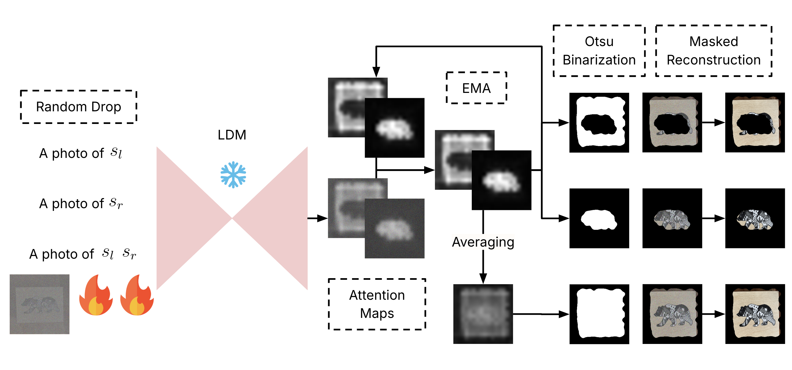

# AGTree: Attention Guided Visual Concept Decomposition

<a href="https://www.apache.org/licenses/LICENSE-2.0.txt"></a>  

This is the official Github repository for [AGTree: Attention Guided Visual Concept Decomposition](https://drive.google.com/file/d/1Lhk0NEJsf9AXwXrjmoTl0_GAZG2sqX7o/view?usp=sharing) ([Defense Slides](http://tinyurl.com/thesis-defense-jack)).

AGTree is proposed by [Wei-Jie (Jack) Chen](https://jackchen890311.github.io/)  from the[ Department of Computer Science and Information Engineering at National Taiwan University](https://www.csie.ntu.edu.tw/) as his master’s thesis.  



## Environment
Please use conda / miniconda and `environment.yml` to set up environment.  
After installing conda / miniconda, run:
```bash
conda env create -f environment.yml
```
and then run the code using
```bash
bash scripts/run_single.sh
```

# Acknowledgements
Our code is based on the following excellent works:
 - [google/inspiration_tree](https://github.com/google/inspiration_tree)  
 - [google/prompt-to-prompt](https://github.com/google/prompt-to-prompt)

# Contact
You can reach me at [jackchen20000311@gmail.com](mailto:jackchen20000311@gmail.com) or [r12922051@csie.ntu.edu.tw](mailto:r12922051@csie.ntu.edu.tw) .

 <!-- ## Citation
If you find this useful for your research, please cite the following:
```bibtex
``` -->
